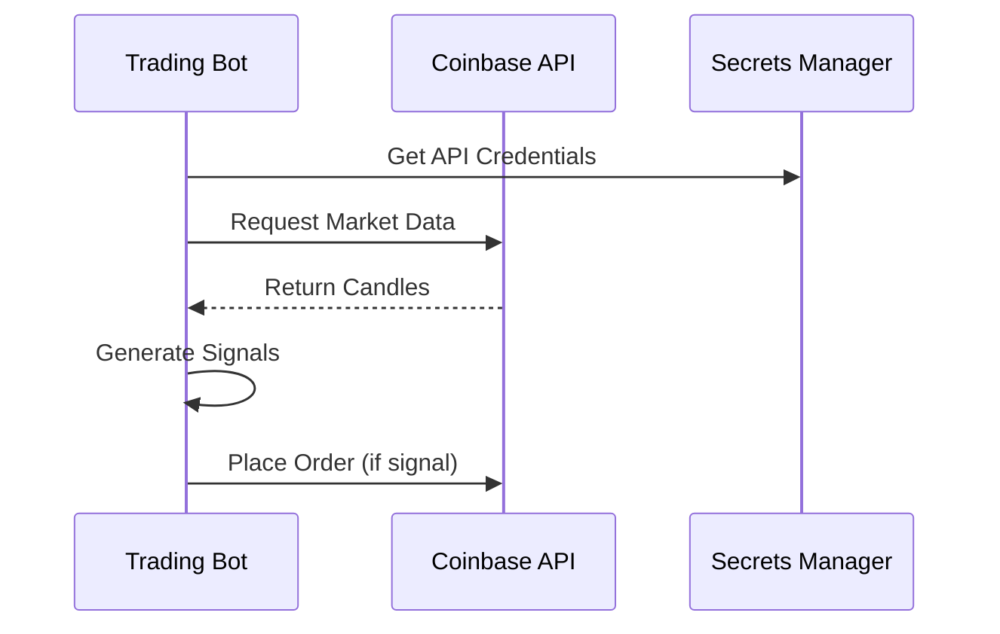

# Data Flow Diagram

```mermaid
sequenceDiagram
    participant TB as Trading Bot
    participant CB as Coinbase API
    participant SM as Secrets Manager
    
    TB->>SM: Get API Credentials
    TB->>CB: Request Market Data
    CB-->>TB: Return Candles
    TB->>TB: Generate Signals
    TB->>CB: Place Order (if signal)
```

[data-flow.svg to be generated from this diagram] 