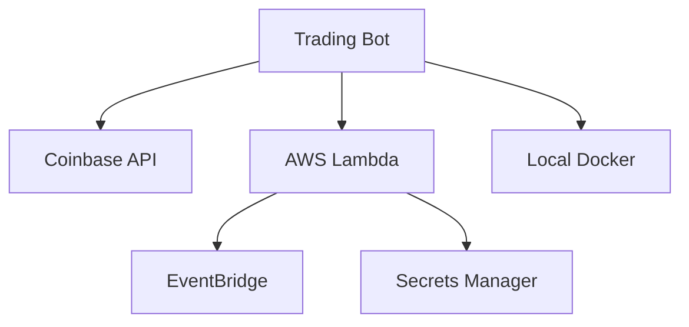

# High-Level System Architecture

```mermaid
graph TD
    A[Trading Bot] --> B[Coinbase API]
    A --> C[AWS Lambda]
    C --> D[EventBridge]
    C --> E[Secrets Manager]
    A --> F[Local Docker]
```

[high-level-design.svg to be generated from this diagram] 